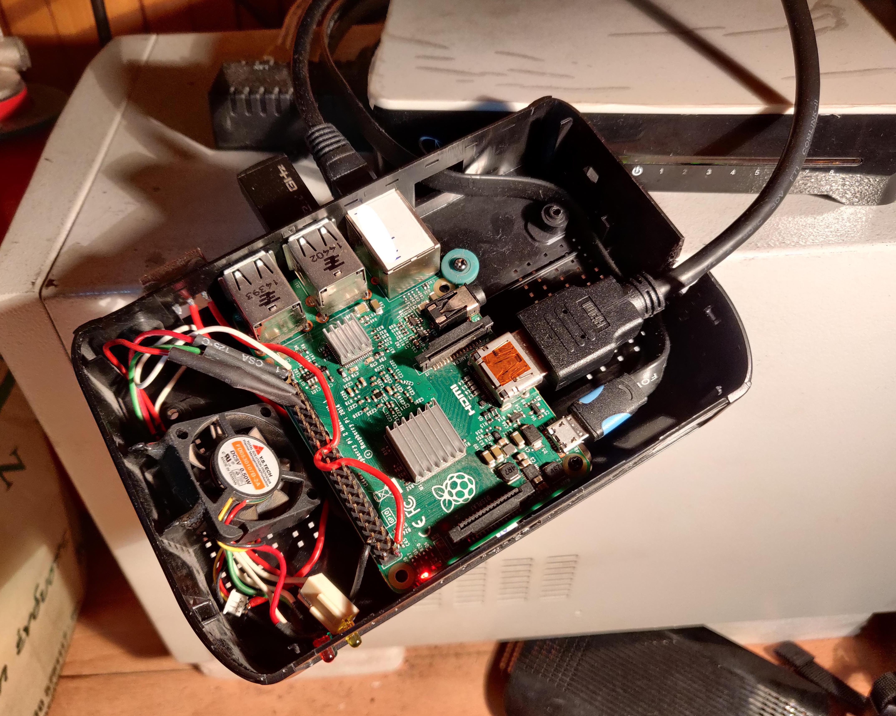

# Raspberry-born

Steps to follow for a fresh *raspbian* installation. Includes instructions for configuring:

- dynamic DNS
- oh-my-zsh
- two-factor authentication
- pi-hole
- OpenVPN server
- etc

 

> **DISCLAIMER:** not all the code in this repository is developed by me. All original articles and/or Git repos are referred.
>
> The code in this repository is provided *"as is"*. I take no responsibility for mistakes, S/W and/or H/W damage, security breaches whatsoever.
>
> This repository will be updated according to my personal interests and needs.
> 
> Comments and recommendations are always welcome! :smiley:

 

## Index

### Important steps

[First steps](https://github.com/smyrnakis/raspberry-born/blob/main/chapters/first-steps.md) - prepare SD card & initial login

[Initial settings](https://github.com/smyrnakis/raspberry-born/blob/main/chapters/initial-settings.md) - change default username & password / add SSH keys

[Harden security](https://github.com/smyrnakis/raspberry-born/blob/main/chapters/harden.md) - tips 'n' tricks to secure the Raspberry Pi

### Chapters (alphabetically)

[Auto-start program at boot](https://github.com/smyrnakis/raspberry-born/blob/main/chapters/autostart.md) - example with *noip*

[Auto updates](https://github.com/smyrnakis/raspberry-born/blob/main/chapters/auto-updates.md) - configure daily automatic updates

[Backup the Raspberry pi](https://github.com/smyrnakis/raspberry-born/blob/main/chapters/backup.md) - manual or automatic backup of microSD card

[Dynamic DNS (ddclient & noip DUC)](https://github.com/smyrnakis/raspberry-born/blob/main/chapters/dynamic-dns.md) - install & configure *ddclient* or *noip DUC*

[Emails from Raspberry pi](https://github.com/smyrnakis/raspberry-born/blob/main/chapters/email.md) - Configure *msmtp* client to send emails

[Message Of The Day - MOTD](https://github.com/smyrnakis/raspberry-born/blob/main/chapters/motd.md) - Customise the MOTD

[Network mapper - Nmap](https://github.com/smyrnakis/raspberry-born/blob/main/chapters/nmap.md) - Nmap tool usage

[oh-my-zsh terminal](https://github.com/smyrnakis/raspberry-born/blob/main/chapters/zsh.md) - install & configure *oh-my-zsh* with *autosuggestions* and *syntax highlighting*

[OpenVPN server](https://github.com/smyrnakis/raspberry-born/blob/main/chapters/vpn.md) - install & configure an *OpenVPN* server that can work together with *Pi-hole*

[Pi-hole](https://github.com/smyrnakis/raspberry-born/blob/main/chapters/pihole.md) - install & configure *Pi-hole* ad-blocker (better install *Pi-hole* **after** installing *OpenVPN*)

[Thingspeak monitoring system](https://github.com/smyrnakis/raspberry-born/blob/main/chapters/thingSpeak.md) - monitor Raspi's CPU temp & load averages *and* ambient temperature & humidity (using *DHT11* sensor & [*Thingspeak*](https://thingspeak.com/) platform)

[Two-factor authentication](https://github.com/smyrnakis/raspberry-born/blob/main/chapters/2FA.md) - require 2FA for SSH log in with password

[Uncomplicated FireWall - UFW](https://github.com/smyrnakis/raspberry-born/blob/main/chapters/harden.md#uncomplicated-firewall-ufw) - install & configure UFW

[vim editor](https://github.com/smyrnakis/raspberry-born/blob/main/chapters/vim.md) - install & configure vim editor

 

## Extra

[Various commands](https://github.com/smyrnakis/raspberry-born/blob/main/chapters/extra.md) - useful commands

 

 