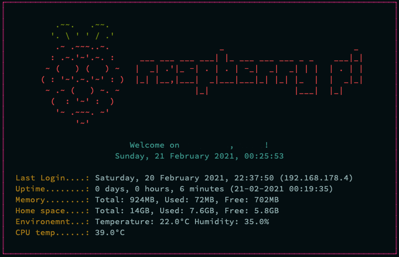

# Message Of The Day (MOTD)



## Files location
``` bash
# static file
/etc/motd

# dynamic file
/var/run/motd.dynamic

# scripts updating dynamic file are under:
/etc/update-motd.d/
```

## Remove current MOTD
Remove and disable the default MOTD:
``` bash
# disable MOTD
sudo systemctl disable motd

# remove the motd file
sudo rm -f /etc/motd

# remove the script updating the motd file
sudo rm /etc/update-motd.d/10-uname
```

## Disable messages from *sshd*
``` bash
sudo nano /etc/ssh/sshd_config
```

Change the following accordingly:
``` bash
PrintMotd no
PrintLastLog no
```

## Create new file
``` bash
# script updating motd file
cd ~
mkdir Software
mkdir Software/various
sudo touch Software/various/motd.sh

# change permissions
sudo chown root:root /home/{YOUR-USERNAME}/Software/various/motd.sh
sudo chmod +x /home/{YOUR-USERNAME}/Software/various/motd.sh
```

In the file `motd.sh` add the code from the file [motd.sh](https://github.com/smyrnakis/raspberry-born/blob/main/src/motd.sh).

## Test
You can test the script by running:
``` bash
bash Software/various/motd.sh
```

## Add new script
Edit your `profile` file:

``` bash
# default profile
nano ~/.profile

# zsh profile
nano ~/.zshrc
```

Add the full path to the new script at the end of the file:
``` bash
/home/{YOUR-USERNAME}/Software/various/motd.sh
```

<br>

### Feature work

``` bash
# Running processes
ps ax | wc -l | tr -d " "
```

``` bash
# Pi-hole status
sudo pihole -c -j

# example output
{"domains_being_blocked":1195899,"dns_queries_today":65917,"ads_blocked_today":30020,"ads_percentage_today":45.542122}
```

``` bash
# weather info
curl -s "http://rss.accuweather.com/rss/liveweather_rss.asp?metric=1&locCode=EUR|UK|UK001|NAILSEA|" | sed -n '/Currently:/ s/.*: \(.*\): \([0-9]*\)\([CF]\).*/\2°\3, \1/p'
```