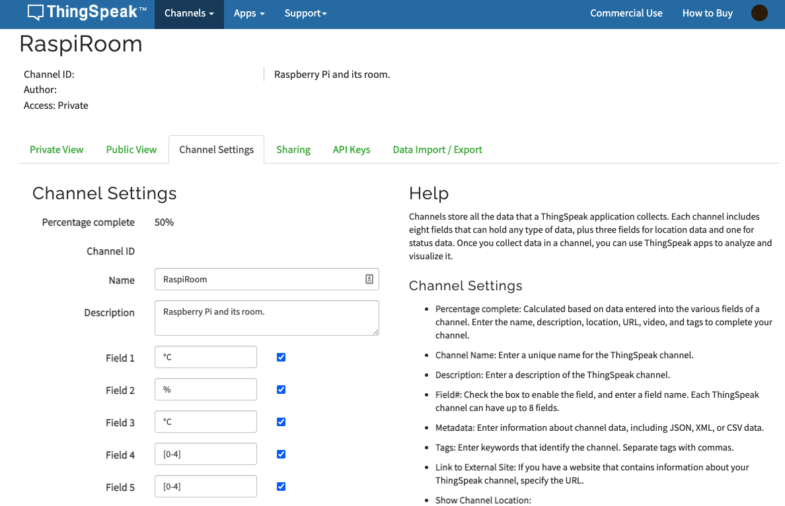
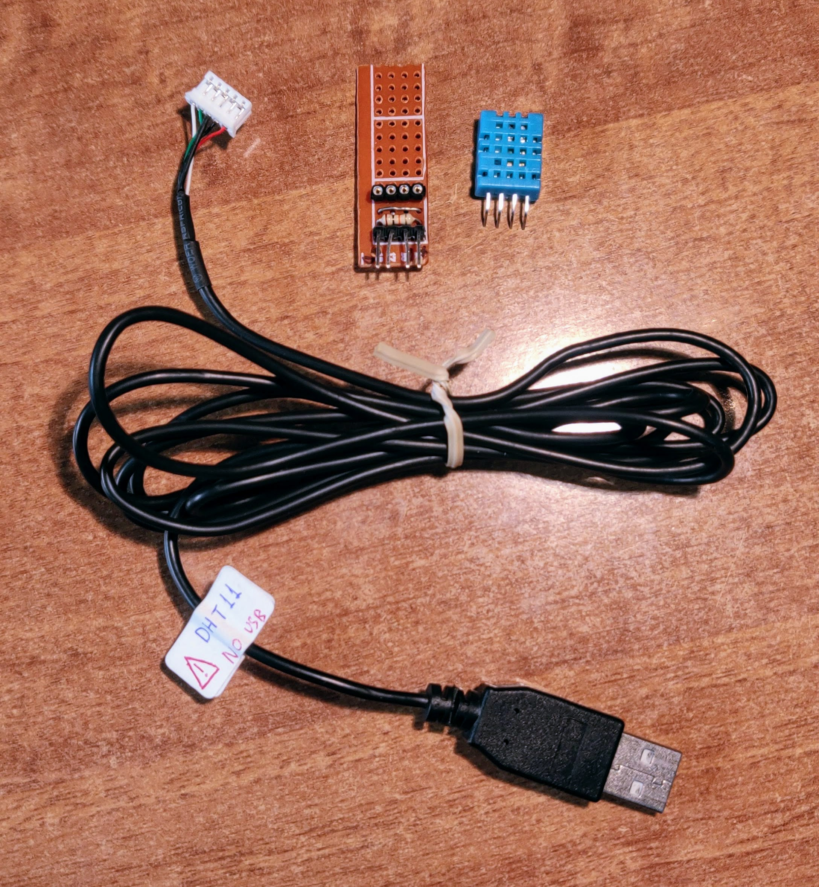
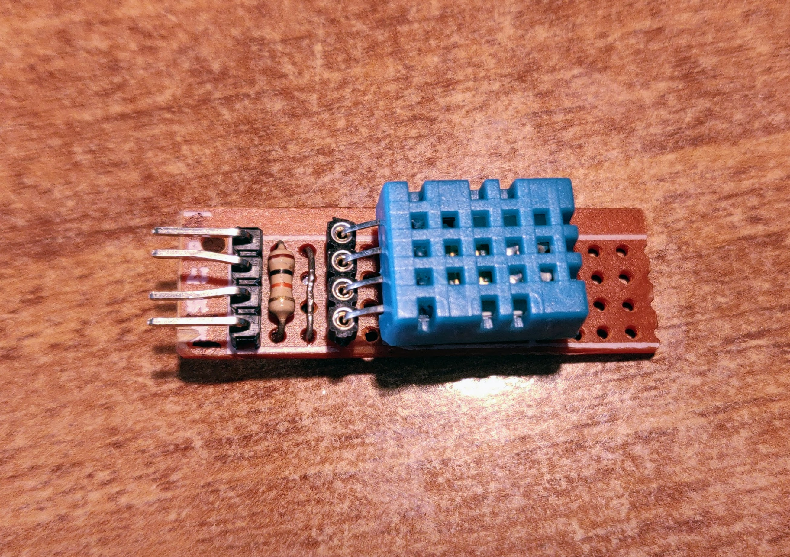
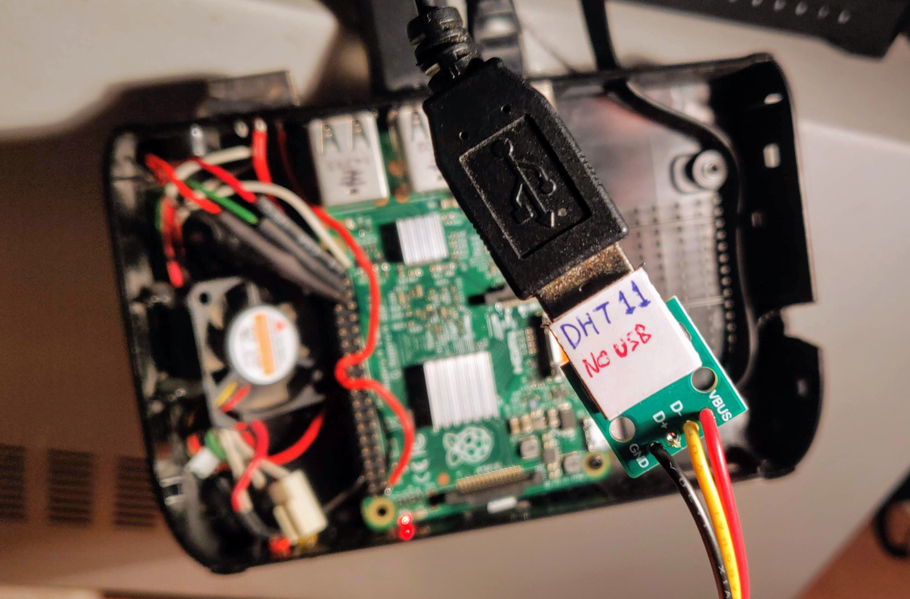

# Thingspeak based monitoring system

*Article 1: https://iotdesignpro.com/projects/how-to-send-data-to-thingspeak-cloud-using-raspberry-pi*

*Article 2: https://www.instructables.com/Build-Your-First-IOT-with-a-Raspberry-Pi-DHT11-sen/*

<br>

In the following guide you'll create a channel in [Thingspeak](https://thingspeak.com/) which will be updated by the Raspberry Pi.

The data will include ambient *temperature* and *humidity* (from a **DHT11** sensor), Raspberry's core temperature and the average loads (1, 5, 15 minutes).

## Thingspeak preparation

Register a free account on [Thingspeak website](https://thingspeak.com/) and create a channel. Name the fields and save the changes.

<p float="center">
  
</p>

<!--  -->

Next, go on *API Keys* and note down the **Write API key**.

## Hardware preparation

You will need a *DHT11* sensor and a *10KΩ resistor*.

- Connect the sensor's **Vcc** pin to the **3.3V** pin on Raspberry pi.
- Connect the sensor's **Ground** pin to a **Ground** pin on Raspberry pi.
- Connect the sensor's **Signal** pin to Raspberry's pin **GPIO23**.
- Connect the **10KΩ** resistor between *signal/GPIO23* and *Vcc/3.3V* pins.

<br>

<p float="left">
  
  
</p>

<!--


-->

<br>

I am using a custom made PCB board to hold the sensor, an 1-meter USB cable and a USB port connected on Raspberry Pi's GPIO23, 3.3V & GND pins.

<p float="left">
  
  
  
</p>

<!--


-->

## Monitoring script

Create a directory named `Thingspeak`, subdirectory of `Software` in your `$HOME`:
``` bash
cd ~
mkdir Software
mkdir Software/thingspeak
cd Software/thingspeak
```

Create a file called `thingspeak.py` and paste the code from the file [thingspeak.py](https://github.com/smyrnakis/raspberry-born/blob/main/src/thingspeak.py) .

Replace with your *Thingspeak WRITE API key* in `line 15` and with your `{YOUR-USERNAME}` in `line 26` and `line 30`:

``` bash
nano thingspeak.py
```

Make the script executable:
``` bash
chmod +x thingspeak.py
```

You need to install `Adafruit_DHT` module:
``` bash
git clone https://github.com/adafruit/Adafruit_Python_DHT.git
cd Adafruit_Python_DHT

# for Python 2.7
sudo python setup.py install

# for Python 3
sudo python3 setup.py install
```

*NOTE:* every successful read of DHT11 is updating the files `temperature` & `humidity` located in `$HOME/Software/thingspeak/`.

## Testing

The script can be tested by enabling *debugging messages* in `line 17`:
``` python
showDebugs = True
```

Execute it:
``` bash
python3 thingspeak.py
```

To kill the script, *suspend* it (`Ctrl + Z`) and then use the `kill` command:
``` bash
# in this example PID: 21186
^Z
[1]  + 21186 suspended  Software/thingspeak/thingspeak.py

sudo kill 21186
```

*Note:* to bring back a suspended process, use the `fg` command:
``` bash
fg
[1]  - 21186 continued  Software/thingspeak/thingspeak.py
```

Another way to kill the script, is to find the process ID using `PS` and then use `kill` command:
``` bash
# in this example PID: 13508
ps fauxww | grep -A 1 'python'
> 13508 pts/0    T      0:09 /usr/bin/python3 thingspeak.py

sudo kill 13508
```

## Autostart on reboot

Set the script to run on Raspberry's boot:
``` bash
sudo crontab -e
```

and add the line:
``` bash
@reboot /home/{YOUR-USERNAME}/Software/thingspeak/thingspeak.py
```
Since we added interpreter (the line `#!/usr/bin/python3` at the beginning of the script), we do not need to `python3` call before the script path.

<br>

<p float="left">
  
  
</p>

<!--


-->

<br>